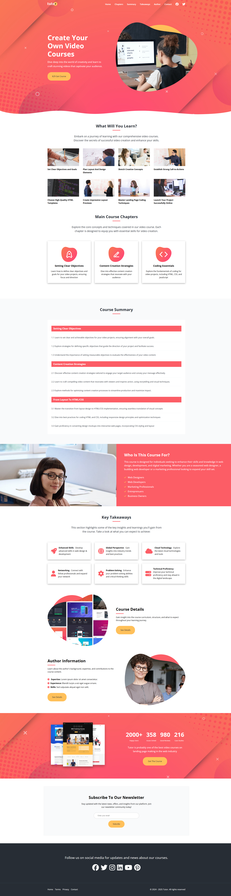
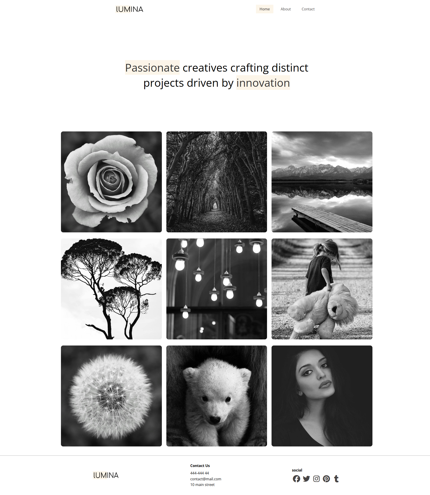
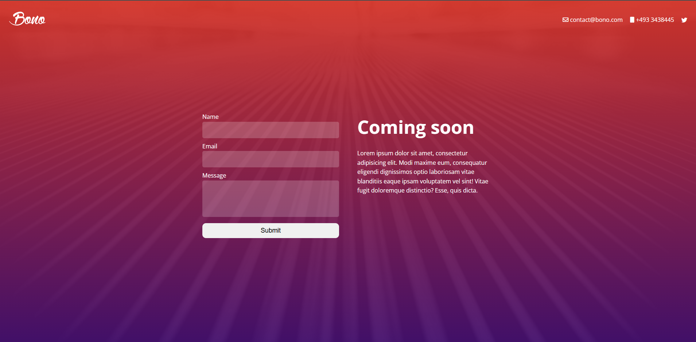

# 🌐 Modern HTML & CSS

A collection of projects, exercises, and practice files built while completing **Modern HTML & CSS From The Beginning 2.0** by **Brad Traversy** on Udemy.

This repository demonstrates my understanding of modern **HTML5** and **CSS3** concepts through real-world, responsive website projects without using JavaScript frameworks.

---

## 📁 Folder Structure

```text
Project Root
├── CSS
│   ├── 1 css-basics
│   ├── 2 box-model-and-positioning
│   ├── 3 flexbox
│   ├── 4 responsive-design
│   ├── 5 various-css-features
│   ├── 6 advanced-selectors-and-pseudo
│   ├── 7 css-grid
│   └── 8 transitions-and-animations
├── HTML
│   ├── 1 essential-html
│   ├── 2 html-forms-and-input-elements
│   └── 3 additional-html-elements
├── Bono landing page
├── leno-website (BEM)
├── lumina website
└── tutor website
└── screenshots
```

---

## 🚀 Live Demos

- **Leno Website** – [**Live**](https://leno-health.netlify.app/)
- **Tutor Website** – [**Live**](https://tutor-guide.netlify.app/)
- **Lumina Website** – [**Live**](https://luumina.netlify.app/)
- **Bono Landing Website** – [**Live**](https://bono-f.netlify.app/)

---

## 🛠 Technologies & Concepts Used

- HTML5 (Semantic Markup)
- CSS3
- Flexbox
- CSS Grid
- Responsive Design
- Media Queries
- CSS Variables (Custom Properties)
- Animations & Transitions
- **BEM (Block Element Modifier) Naming Convention**
- Utility-First CSS Patterns
- Lightbox (in Lumina)
- Font Awesome (icons)
- Google Fonts

---

---

## 📂 Projects Included

### 1️⃣ Leno App

- Fully responsive productivity assistant
- Flexbox & CSS Grid layout
- Clean and semantic HTML structure
- **BEM Naming Convention**
- 

### 2️⃣ Tutor

- Multi-page online tutor website
- Smooth scrolling navigation
- Contact page included
- Reusable utility classes
- 

### 3️⃣ Lumina

- Portfolio website
- CSS Grid-based layout
- Multi-page feature
- Fully responsive
- Lightbox integration
- 

### 4️⃣ Bono

- Landing page with form
- CSS Flex-based layout
- Fully responsive
- 

---

## 📚 What I Learned

- Writing clean, semantic **HTML5**
- Structuring scalable and maintainable **CSS**
- Building responsive layouts using **Flexbox** and **CSS Grid**
- Improved accessibility (**ARIA** roles, keyboard navigation, contrast)
- Organizing styles using **BEM methodology**
- Creating reusable utility classes
- Using **CSS variables** for consistent theming
- Adding smooth **animations and transitions**
- Integrating **Lightbox** and **Font Awesome**
- Deploying static websites using modern hosting platform **netlify**

## ⚙️ Usage

You can explore and run these projects locally in a few simple steps:

1️⃣ Clone the Repository

Click the "Copy" button next to the command (or copy manually):

```bash
https://github.com/Sobuj54/Learning-HTML-CSS.git
```

2️⃣ Navigate into the Project Folder

3️⃣ Open a Project

### You have two options to run the projects locally:

Option A: Using Live Server (Recommended)

1. Open your code editor (e.g., VS Code) in the project folder.
2. Right-click `index.html` and select **“Open with Live Server”**.
3. Your browser will open the project, and any changes you make will auto-refresh.

Option B: Opening Directly in Browser

1. Navigate to the project folder.
2. Double-click `index.html`.
3. The project will open in your default browser.

## 🎓 Course Credit

These projects are based on the Udemy course:  
**Modern HTML & CSS From The Beginning 2.0** by **Brad Traversy**

## ⚠️ Disclaimer

This repository is for educational purposes only.  
Designs and project ideas are inspired by the course material.
